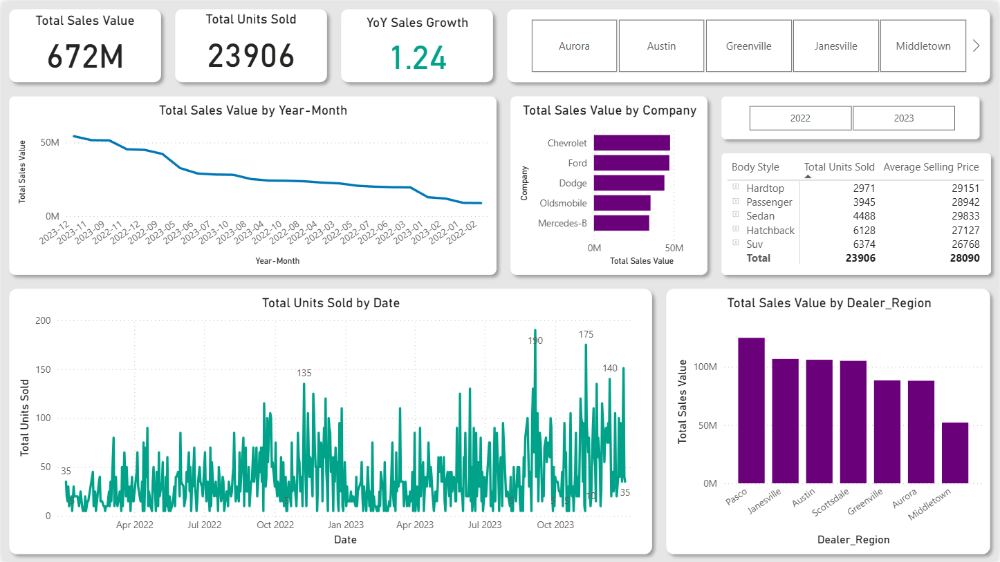

# Supply Chain & Inventory Optimization Dashboard

This project demonstrates the creation of a comprehensive Supply Chain and Inventory Optimization Dashboard using **Power BI**. The goal was to transform raw sales transactional data into actionable insights for managers to improve inventory flow, minimize stockouts, and optimize resource allocation based on sales velocity and geographic performance.

---

## Key Features and Business Value

* **Sales Velocity Analysis:** Tracks the movement of units and value over time to identify seasonality and growth trends.
* **Geographic Optimization:** Ranks dealer regions based on sales volume to prioritize logistics and inventory investment.
* **Performance Alerts:** Uses **Conditional Formatting (DAX)** to instantly highlight positive (Green) and negative (Amber) Year-over-Year sales growth.
* **Star Schema Data Model:** Implements a robust data model for fast, accurate time-intelligence and filtering capabilities.

---

## Actionable Insights and Optimization Focus

The primary purpose of this dashboard is to move beyond simple reporting and drive decisions:

1.  **Prioritization of Logistics:** The **Regional Performance Ranking (Bar Chart)** instantly identifies the top 3-5 dealers/regions contributing the highest sales volume. This data dictates where the supply chain manager must prioritize resource allocation and logistics investments to prevent high-impact stockouts.
2.  **Inventory Holding Cost Reduction:** By analyzing the **Product Segmentation** (Bar Chart), low-selling brands or models (low velocity) are flagged. This signals to the inventory manager where capital is tied up, leading to targeted promotional campaigns or clearance sales to reduce holding costs.
3.  **Demand Forecasting Validation:** The **YoY Sales Growth Card** provides immediate feedback. If the card shows **Amber/Orange** (negative growth), it alerts the team that demand is shrinking, and procurement plans/safety stock levels for the next period must be immediately reviewed and reduced.
4.  **Trend-Based Stocking:** The **Velocity Trends Chart (Line Chart)** reveals seasonality. For instance, if certain models historically peak in Q2, the manager must proactively increase inventory orders by the end of Q1, mitigating future delays.

---

## Repository Files

| File Name | Description |
| :--- | :--- |
| **`Supply_Chain_Optimization_Dashboard.pbix`** | The main Power BI Desktop file containing the data model, DAX measures, and final visualizations. |
| **`raw_inventory_sales_data.csv`** | The raw, anonymized sales transactional data used as the source for the entire project. |
| **`dashboard_overview.png`** | High-level screenshot of the final dashboard layout and key visuals. |

---

## Technical Implementation Summary

### 1. Data Transformation (Power Query)

* **Cleaning:** Addressed data quality issues, including handling date type conversions (`Date` column), removing encoding errors (e.g., in `Engine`), and applying trimming/capitalization to text fields.
* **Preparation:** Split the compound `Dealer_No` column to extract the clean 5-digit `Zip_Code`.

### 2. Data Modeling (Star Schema)

The dashboard utilizes a **Star Schema** centered around the transactional **`car_data`** fact table, ensuring efficient query performance.

* **Fact Table:** `car_data` (Sales transactions).
* **Dimension Tables:**
    * `Calendar` (Created using DAX, linked to `car_data[Date]`).
    * `Dim Dealer` (Unique list of dealers and regions, linked to `car_data[Dealer_Name]`).
    * `Dim Product` (Unique list of car models and brands, linked to `car_data[Car_id]`).

### 3. Key DAX Measures

A dedicated `Measures` table was created to house the core KPIs.

| Measure | Formula Type | Purpose |
| :--- | :--- | :--- |
| `Total Sales Value` | Aggregation | Total revenue generated (inventory value moved). |
| `Total Units Sold` | Row Count | Total number of cars/units sold (inventory velocity). |
| `YoY Sales Growth` | Time Intelligence | Calculates percentage change against the same period last year. |
| `Average Selling Price` | Iteration (AVERAGEX) | Tracks the average value of inventory being sold. |

---

## Final Dashboard View

Below is a snapshot of the final dashboard, illustrating the key metrics and ranking visuals used to guide optimization decisions:

---
